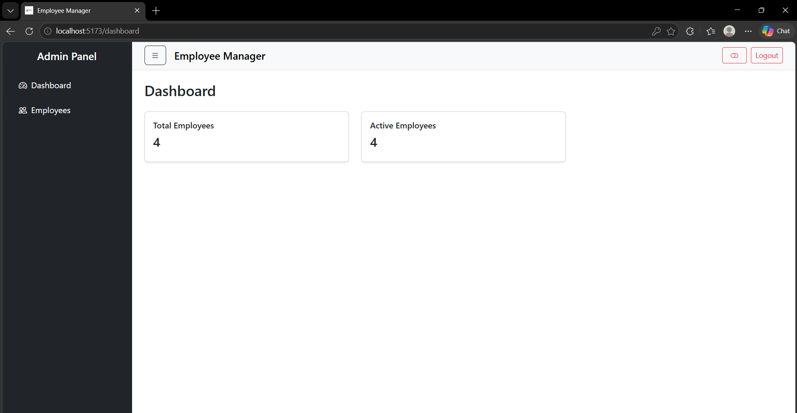
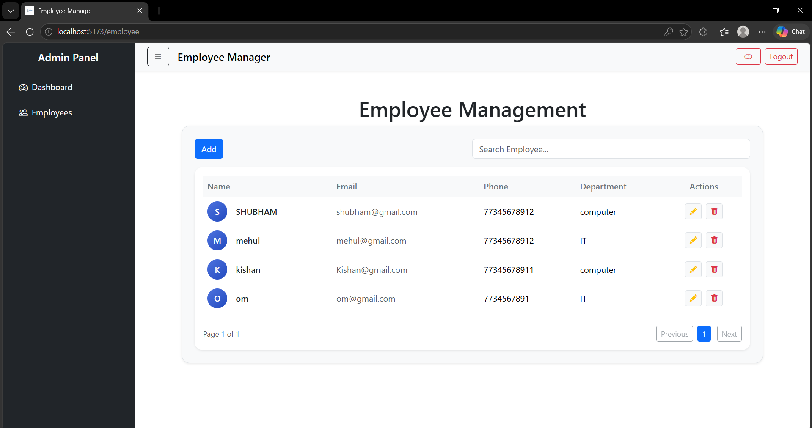
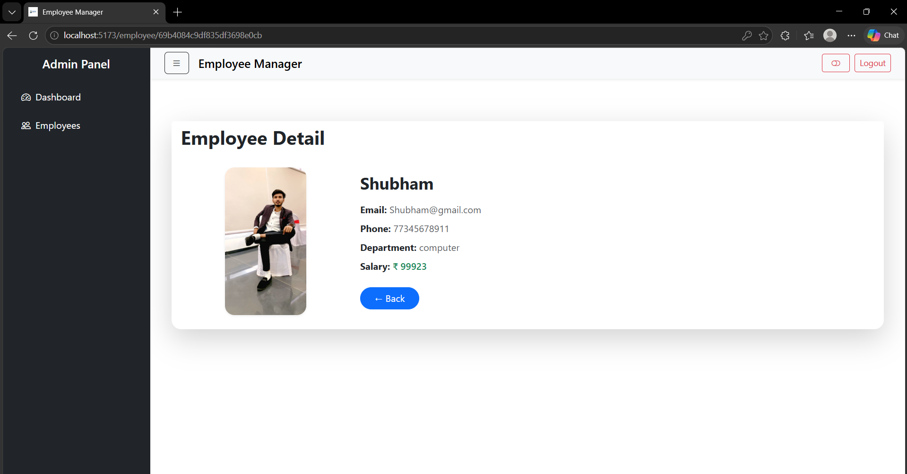
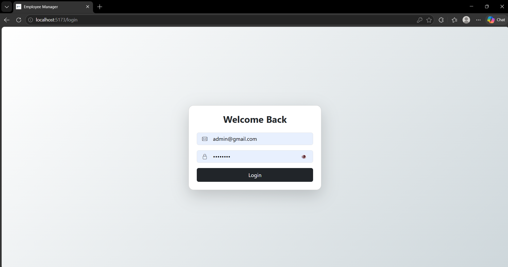

# Employee Management System (MERN Stack)

A full-stack **Employee Management System** built using the **MERN Stack (MongoDB, Express.js, React, Node.js)**.
This application allows administrators to manage employees and employees to view their personal profile.

## 🚀 Features

### 🔐 Authentication

* Role-based access control (**Admin / Employee**)

### 👨‍💼 Admin Features

* Admin Dashboard
* Add new employees
* Update employee details
* Delete employees
* View all employees
* Manage employee records

### 👤 Employee Features

* Employee login
* View personal profile
* Access only their own data
* Back button to logout and return to login page

### 📊 Dashboard

* Admin can view all employee information in a structured dashboard.
* Quick navigation for employee management.

### 🛠 CRUD Operations

The system supports full CRUD functionality:

* **Create** – Add new employees
* **Read** – View employee details
* **Update** – Edit employee information
* **Delete** – Remove employee records

## 📷 Screenshot 

**Dashboard**


**Home**


**ProfileDetail**


**Login**


## 🧰 Technologies Used

### Frontend

* React.js
* Vite
* React Router
* CSS / Boostrap

### Backend

* Node.js
* Express.js

### Database

* MongoDB
* Mongoose


## 📁 Project Structure

```
Employee-Management-System
│
├── backend
│   ├── models
│   ├── routes
│   ├── controllers
│   ├── Middlewares
│   └── server.js
│
├── frontend
│   ├── components
│   ├── Layout
│   ├── pages
│   ├── context
│   └── App.jsx
```

## ⚙️ Installation

### 1️⃣ Clone the repository

```
git clone https://github.com/your-username/employee-management-system.git
```

### 2️⃣ Install backend dependencies

```
cd backend
npm install
```

### 3️⃣ Install frontend dependencies

```
cd frontend
npm install
```

### 4️⃣ Run the project

Backend:

```
npm run index.js
```

Frontend:

```
npm run dev
```

## 🔑 Role Based Access

| Role     | Access                                  |
| -------- | --------------------------------------- |
| Admin    | Dashboard, Employee Management, Profile |
| Employee | Only Profile Page                       |

## 📌 Future Improvements

* Search and filter employees
* Employee attendance system
* File upload (profile image)
* Pagination
* Admin analytics dashboard

## 👨‍💻 Author

Developed by **Shubham❤️**

---

⭐ If you like this project, consider giving it a star on GitHub.
